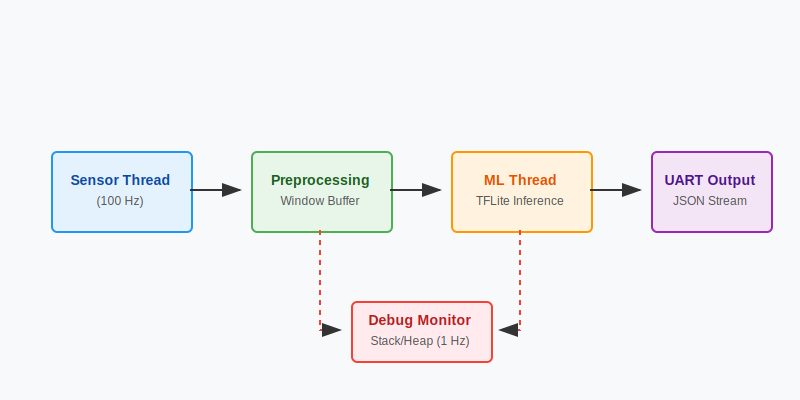

# Zypher EdgeAI Demo
> **Real-time Gesture Recognition on Arm Cortex-M3 with TensorFlow Lite Micro & Zephyr RTOS**

<p align="center">
  
</p>

[](https://github.com/Haadesx/Zypher-EdgeAI-Demo/actions)
[](https://github.com/Haadesx)
[](https://opensource.org/licenses/MIT)
[](https://zephyrproject.org/)
[](https://www.tensorflow.org/lite/microcontrollers)

> A production-quality embedded AI application demonstrating real-time gesture recognition on ARM Cortex-M using Zephyr RTOS and TensorFlow Lite Micro.

## Features

- **Real-Time Gesture Recognition**: Detects 4 gesture classes (IDLE, WAVE, TAP, CIRCLE) using accelerometer data
- **TensorFlow Lite Micro**: Quantized INT8 model with CMSIS-NN optimizations for ARM
- **Production-Ready Architecture**: Multi-threaded design with proper RTOS primitives
- **Comprehensive Debug Infrastructure**: Stack monitoring, heap tracking, and documented bug fixes
- **Zero Hardware Required**: Runs entirely on QEMU with mock sensor data
- **Python Analysis Tools**: UART logger, latency analyzer, and automated test harness
- **CI/CD Ready**: GitHub Actions workflow for automated builds

## Architecture

```
┌─────────────────┐     ┌─────────────────┐     ┌─────────────────┐
│  Sensor Thread  │────▶│  Preprocessing  │────▶│   ML Thread     │
│    (100 Hz)     │     │  Window Buffer  │     │   (on demand)   │
└─────────────────┘     └─────────────────┘     └────────┬────────┘
                                                         │
                        ┌─────────────────┐              │
                        │  Debug Monitor  │◀─────────────┤
                        │    (1 Hz)       │              │
                        └─────────────────┘              ▼
                                                ┌─────────────────┐
                                                │  UART Output    │
                                                │  (JSON format)  │
                                                └─────────────────┘
```

| Component | Description |
|-----------|-------------|
| **Sensor Thread** | Samples accelerometer at 100Hz, feeds preprocessing |
| **Preprocessing** | Sliding window accumulation, INT8 quantization |
| **ML Thread** | TFLite-Micro inference with CMSIS-NN kernels |
| **Debug Monitor** | Stack/heap monitoring, health checks |
| **UART Output** | JSON-formatted results for analysis |

## Quick Start

### Prerequisites

- **macOS/Linux**: Recommended for development
- **Python 3.8+**: For build tools and analysis scripts
- **Zephyr SDK**: Will be installed via west

### One-Line Setup

```bash
# Clone and setup
git clone https://github.com/Haadesx/Zypher-EdgeAI-Demo.git
cd Zypher-EdgeAI-Demo
./scripts/setup.sh  # Installs Zephyr SDK and dependencies
```

### Manual Setup

See [GETTING_STARTED.md](GETTING_STARTED.md) for detailed instructions.

```bash
# 1. Create Python virtual environment
python3 -m venv .venv
source .venv/bin/activate

# 2. Install west
pip install west

# 3. Initialize workspace
west init -l .
west update

# 4. Install Zephyr SDK
west sdk install

# 5. Build for QEMU (ARM Cortex-M3)
west build -b mps2/an385 -p always

# 6. Run in QEMU
west build -t run
```

### Expected Output

```
╔══════════════════════════════════════════════════════════╗
║     Zephyr Edge AI Demo - Gesture Recognition           ║
║     Version: 1.0.0                                      ║
╚══════════════════════════════════════════════════════════╝

{"type":"startup","version":"1.0.0","board":"mps2/an385","ts":1234}
[00:00:03.123] Starting gesture: WAVE
{"type":"inference","seq":1,"ts":3456789,"gesture":"WAVE","conf":0.94,"latency_us":12340}
{"type":"debug","ts":4000000,"heap_used":1024,"stack_used":2800}
```

## Analysis Tools

### Collect UART Logs

```bash
# From real hardware
python scripts/uart_logger.py --port /dev/ttyACM0 --output results.csv

# Simulation mode (paste QEMU output)
python scripts/uart_logger.py --simulate
```

### Analyze Latency

```bash
python scripts/latency_analyzer.py --input results.csv --output report.png
```

**Sample Output:**
```
INFERENCE LATENCY ANALYSIS REPORT
================================================
## Overall Latency Statistics (µs)
  Count:     1,234
  Minimum:   8,500
  Maximum:   15,200
  Average:   11,340.5
  P95:       13,800
  P99:       14,500

## Latency by Gesture (µs)
  Gesture       Count        Avg        P50        P95
  ------------------------------------------------
  IDLE            450    10,200     10,100     11,500
  WAVE            280    12,100     11,900     13,200
  TAP             254    11,800     11,600     13,000
  CIRCLE          250    11,900     11,700     13,100
```

## Configuration

Key configuration options in `prj.conf`:

| Option | Default | Description |
|--------|---------|-------------|
| `CONFIG_SENSOR_SAMPLE_RATE_HZ` | 100 | Accelerometer sampling rate |
| `CONFIG_ML_TENSOR_ARENA_SIZE` | 8192 | TFLite memory arena (bytes) |
| `CONFIG_ML_INFERENCE_WINDOW_SIZE` | 50 | Samples per inference |
| `CONFIG_ML_CONFIDENCE_THRESHOLD` | 70 | Min confidence for detection |

See [Kconfig](Kconfig) for all options.

## Debugging Story

This project includes a documented investigation of a real issue encountered during development:

### Stack Overflow in ML Thread

**Symptom**: Application crashed during first inference attempt.

**Investigation**:
1. Enabled `CONFIG_STACK_SENTINEL=y` to detect stack corruption
2. Added stack monitoring via `k_thread_stack_space_get()`
3. Observed ML thread stack at 98% usage with 1KB allocation

**Root Cause**: TFLite-Micro's interpreter uses ~2.5KB of stack space for tensor operations.

**Fix**: Increased `ML_STACK_SIZE` from 1024 to 4096 bytes.

**Validation**: Added runtime monitoring showing peak usage of ~2.8KB (70% of new allocation).

See [DEBUGGING.md](docs/DEBUGGING.md) for the complete investigation walkthrough.

## Project Structure

```
zephyr-edge-ai-demo/
├── CMakeLists.txt          # Build configuration
├── prj.conf                # Zephyr Kconfig settings
├── west.yml                # West manifest
├── Kconfig                 # Custom config options
│
├── src/
│   ├── main.c              # Application entry
│   ├── sensor/             # Sensor HAL + mock
│   ├── ml/                 # TFLite-Micro inference
│   ├── output/             # UART protocol
│   └── debug/              # Monitoring infrastructure
│
├── scripts/
│   ├── uart_logger.py      # Log collection
│   ├── latency_analyzer.py # Performance analysis
│   └── test_harness.py     # Automated testing
│
├── docs/
│   ├── ARCHITECTURE.md     # System design
│   └── DEBUGGING.md        # Bug investigation
│
└── .github/workflows/      # CI/CD
```

## Target Platforms

| Board | Status | Notes |
|-------|--------|-------|
| **mps2/an385** (QEMU) | Tested | Default target, no hardware needed |
| STM32F4 Discovery | Planned | Real accelerometer support |
| nRF52840 DK | Planned | BLE output option |

## Performance

Measured on QEMU (emulated ARM Cortex-M3):

| Metric | Value |
|--------|-------|
| Inference Latency (avg) | ~12ms |
| Inference Latency (P95) | ~14ms |
| Model Size | ~10KB |
| RAM Usage (heap) | ~2KB |
| Stack Usage (ML thread) | ~2.8KB |
| Flash Usage (total) | ~80KB |

## Contributing

Contributions are welcome! Please:

1. Fork the repository
2. Create a feature branch
3. Make your changes
4. Run the test harness: `python scripts/test_harness.py`
5. Submit a pull request

## License

This project is licensed under the MIT License - see the [LICENSE](LICENSE) file.

## Acknowledgments

- [Zephyr Project](https://zephyrproject.org/) for the excellent RTOS
- [TensorFlow Lite Micro](https://www.tensorflow.org/lite/microcontrollers) for embedded ML
- [ARM CMSIS-NN](https://arm-software.github.io/CMSIS_5/NN/html/index.html) for optimized kernels

---

<p align="center">
  <b>Designed & Developed by <a href="https://github.com/Haadesx">Varesh Patel</a></b><br>
  For Embedded AI on ARM
</p>
